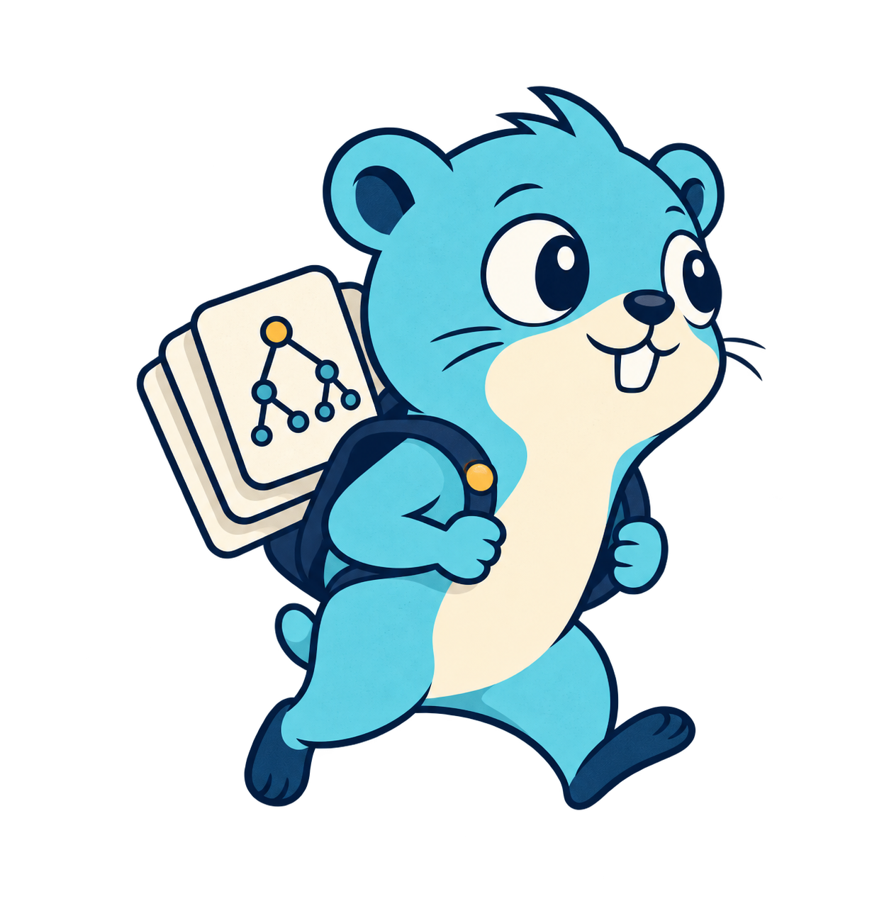

<p align="center">
  
</p>

<h1 align="center">KVLite</h1>

A blazingly-fast embedded key/value database for Go.

[](https://pkg.go.dev/github.com/Issaminu/kvlite) [](go.mod) [](BENCHMARKS.md) [](LICENSE)

KVLite uses a paged B+ tree. It supports transactions, nested buckets, ordered cursors, prefix scans, range scans, and read-only database handles.

> [!WARNING]
> KVLite does not have a stable release yet. Its API and file format can change between pre-release versions. For production usage, wait for the 1.0 release.


## Install

KVLite requires Go 1.23.4 or a later compatible release.

```sh
go get github.com/Issaminu/kvlite@latest
```


## Quick start

This program creates a bucket, stores one value, and reads it back.

```go
package main

import (
	"errors"
	"fmt"
	"log"

	"github.com/Issaminu/kvlite"
)

func main() {
	if err := run(); err != nil {
		log.Fatal(err)
	}
}

func run() (err error) {
	db, err := kvlite.Open("app.db", 0o600, nil)
	if err != nil {
		return err
	}
	defer func() {
		err = errors.Join(err, db.Close())
	}()

	err = db.Update(func(tx *kvlite.Tx) error {
		users, err := tx.Bucket([]byte("users"))
		if errors.Is(err, kvlite.ErrBucketNotFound) {
			users, err = tx.CreateBucket([]byte("users"))
		}
		if err != nil {
			return err
		}
		return users.Put([]byte("42"), []byte("Ada"))
	})
	if err != nil {
		return err
	}

	value, err := db.Get([]byte("users"), []byte("42"))
	if err != nil {
		return err
	}
	fmt.Println(string(value))
	return nil
}
```

The program prints:

```text
Ada
```

Always check the error from `DB.Close`. A writable close moves committed data into the main database file and removes the write-ahead log.

## Features

- Named and nested buckets store byte keys and values.
- Read-only and read-write transactions provide a consistent view and atomic changes.
- Cursors move forward or backward in byte-key order.
- Prefix and half-open range scans visit entries in byte-key order.
- A redo write-ahead log supports recovery after an unclean close.
- CRC32C checksums protect metadata, B+ tree pages, and log records.
- Two metadata pages let KVLite recover when one valid copy remains.
- One open `DB` accepts concurrent method calls.
- Durable concurrent updates can share one log write and storage sync.
- Read-only handles use shared file locks. Writable handles use an exclusive file lock.

After a bucket exists, use `DB.Put` and `DB.Get` for one-key operations:

```go
if err := db.Put([]byte("users"), []byte("42"), []byte("Ada")); err != nil {
	return err
}

value, err := db.Get([]byte("users"), []byte("42"))
if err != nil {
	return err
}
fmt.Println(string(value))
```


## Data model

A database contains named top-level buckets. A bucket can contain key/value pairs and nested buckets. A user value always belongs to a bucket.

`DB.Get` and `DB.Put` provide short operations for an existing top-level bucket. Use `DB.View` or `DB.Update` when several operations must use one database state.

Keys use byte order. A shorter key sorts before a longer key when the shorter key is its prefix. For example, `user/1` sorts before `user/10`.

Create a nested bucket inside a write transaction:

```go
err := db.Update(func(tx *kvlite.Tx) error {
	users, err := tx.CreateBucket([]byte("users"))
	if err != nil {
		return err
	}

	sessions, err := users.CreateBucket([]byte("sessions"))
	if err != nil {
		return err
	}
	return sessions.Put([]byte("current"), []byte("session-1"))
})
if err != nil {
	return err
}
```


## Transactions

`DB.View` starts a read-only transaction. Each read in its callback sees the same database state.

`DB.Update` starts a read-write transaction. Its callback can read its own writes. KVLite commits all changes when the callback returns `nil`. It discards all changes when the callback returns an error or panics.

Do not start a transaction inside another transaction callback. Use the `Tx` value that the callback receives.

A `Tx`, `Bucket`, or `Cursor` is valid only until its transaction callback returns. Do not save it or share it with another goroutine.

Both writes in this callback commit together:

```go
err := db.Update(func(tx *kvlite.Tx) error {
	users, err := tx.Bucket([]byte("users"))
	if err != nil {
		return err
	}
	if err := users.Put([]byte("42/name"), []byte("Ada")); err != nil {
		return err
	}
	return users.Put([]byte("42/role"), []byte("admin"))
})
if err != nil {
	return err
}
```


## Ordered reads

A cursor visits values and nested bucket names in key order. A nested bucket has a nil value. A stored empty value has a non-nil value with length zero.

Use `Cursor.First`, `Cursor.Last`, or `Cursor.Seek` to select an entry. Use `Cursor.Next` or `Cursor.Prev` to continue.

`Bucket.ScanPrefix` visits keys that start with one prefix. `Bucket.ScanRange` visits a half-open range. It includes the start key and excludes the end key.

Do not change a bucket while one of its cursors or scans is in use. Create a new cursor after a bucket change.

Scan only the entries below `user/`:

```go
err := db.View(func(tx *kvlite.Tx) error {
	users, err := tx.Bucket([]byte("users"))
	if err != nil {
		return err
	}
	return users.ScanPrefix([]byte("user/"), func(key, value []byte) error {
		fmt.Printf("%s=%s\n", key, value)
		return nil
	})
})
if err != nil {
	return err
}
```


## Byte-slice ownership

KVLite copies keys and values during a write. The caller can reuse or change the input slices after the write returns.

`DB.Get` returns a copy. The caller can keep and change it.

`Bucket.Get`, `Cursor`, `Bucket.ScanPrefix`, and `Bucket.ScanRange` return or pass read-only slices owned by the transaction. Use `bytes.Clone` when data must remain valid after the callback returns.

Clone a transaction-owned value before the transaction ends:

```go
var saved []byte
err := db.View(func(tx *kvlite.Tx) error {
	users, err := tx.Bucket([]byte("users"))
	if err != nil {
		return err
	}
	value, err := users.Get([]byte("42"))
	if err != nil {
		return err
	}
	saved = bytes.Clone(value)
	return nil
})
if err != nil {
	return err
}
fmt.Println(string(saved))
```


## Durability and recovery

For a database at `app.db`, KVLite can use two files:


| File         | Purpose                                                                        |
| ------------ | ------------------------------------------------------------------------------ |
| `app.db`     | Stores metadata and fixed-size B+ tree pages.                                  |
| `app.db-wal` | Stores committed page images until a checkpoint moves them into the main file. |


A writable open creates the log. A clean writable close removes it. An application or system failure can leave the log beside the main file.

`Open` validates metadata and checksums. It replays complete committed log transactions. It ignores an incomplete final transaction. A checksum error in committed data stops recovery and returns an error.


| Mode         | Behavior                                                                                                                                                  |
| ------------ | --------------------------------------------------------------------------------------------------------------------------------------------------------- |
| `SyncFull`   | Default. A non-empty update returns after KVLite synchronizes its log data to storage. Concurrent updates can share this work.                            |
| `SyncNormal` | Synchronizes at a checkpoint or clean close. A system failure can lose recent committed updates from the operating-system cache.                          |
| `SyncNone`   | Does not synchronize at commit, checkpoint, or close. A system failure can lose updates or damage the database. Use it only for data that can be rebuilt. |


These modes do not change transaction atomicity. They change when committed log data reaches storage.

Select the durability mode in the open options:

```go
options := &kvlite.Options{
	Synchronous: kvlite.SyncFull,
}
```


## Concurrency and file locks

Several `DB.View` callbacks can run at the same time. A `DB.Update` callback runs alone. It waits for active views. New views wait for it.

A writable handle takes an exclusive file lock. Read-only handles take shared locks and can run together. `Options.LockTimeout` limits how long `Open` waits for a conflicting lock. Its zero value waits without a time limit.

KVLite implements file locks for macOS, Linux, BSD systems, Solaris, and Windows. `Open` returns an unsupported-operation error on other systems.

Run independent read transactions on one open database:

```go
results := make(chan error, 2)
for range 2 {
	go func() {
		results <- db.View(func(tx *kvlite.Tx) error {
			_, err := tx.Bucket([]byte("users"))
			return err
		})
	}()
}

for range 2 {
	if err := <-results; err != nil {
		return err
	}
}
```


## Options

`Open` accepts `nil` options. It then uses these defaults:


| Option                     | Default                            | Effect                                                             |
| -------------------------- | ---------------------------------- | ------------------------------------------------------------------ |
| `ReadOnly`                 | `false`                            | Opens a writable database and creates it when needed.              |
| `LockTimeout`              | `0`                                | Waits without a time limit for a conflicting file lock.            |
| `Synchronous`              | `SyncFull`                         | Synchronizes log data before a non-empty update returns.           |
| `CheckpointThresholdBytes` | About 1,000 operating-system pages | Starts a checkpoint after the committed log reaches the threshold. |


See the [package documentation](https://pkg.go.dev/github.com/Issaminu/kvlite) for the complete API and error contracts.

Set only the options that must differ from their defaults. Pass the value to `Open`:

```go
options := &kvlite.Options{
	LockTimeout:              2 * time.Second,
	CheckpointThresholdBytes: 64 << 20,
}
db, err := kvlite.Open("app.db", 0o600, options)
```


## Benchmarks

In [KVBench](benchmarks/kvbench), KVLite led every measured point-read case, every database-scale and access-distribution read case, and every collection-read case. In the highlighted cases, it delivered up to 3.88x the throughput and 25.76x lower p99 latency than the next-fastest engine. It also led durable 95%-read mixed work by 5.39x, no-commit-sync point updates by 2.02x, and clean-open latency by 21.22x.

#### Highlights


| Workload                           | Mode           | KVLite               | bbolt               | Redis               | KVLite lead over second place |
| ---------------------------------- | -------------- | -------------------- | ------------------- | ------------------- | ----------------------------- |
| Mixed work, 95% reads, 32 clients  | Durable        | 192,738 operations/s | 35,789 operations/s | 24,973 operations/s | **5.39x**                     |
| Random point reads, 32 clients     | Read-only      | 3,122,208 keys/s     | 805,566 keys/s      | 196,172 keys/s      | **3.88x**                     |
| Point-read p99 latency, 32 clients | Read-only      | 1.85 µs              | 47.65 µs            | 626.21 µs           | **25.76x lower**              |
| Random point updates, one client   | No commit sync | 182,670 keys/s       | 64,873 keys/s       | 90,652 keys/s       | **2.02x**                     |
| Open an existing clean database    | Life cycle     | 105.11 µs            | 2.23 ms             | Not comparable      | **21.22x lower**              |


The results apply only to the tested machine and workloads. Durable and no-commit-sync results have different guarantees. See the [complete benchmark report](BENCHMARKS.md) and the [benchmark suite guide](benchmarks/kvbench/README.md).

Run the complete suite in its Linux containers:

```sh
cd benchmarks/kvbench
./run-docker.sh
```


## Current limits

- KVLite does not provide a delete or bucket-removal API.
- KVLite does not reuse free pages.
- Each key/value entry must fit in one database page. KVLite does not use overflow pages for large values.
- One database file can have one writable handle or several read-only handles. It cannot have both at the same time.
- A write transaction waits for active read transactions on the same `DB`.
- KVLite does not provide a backup, repair, or full database-check API.
- KVLite does not promise file-format compatibility between pre-release versions.

Check the page-size limit with `errors.Is`:

```go
err := db.Put([]byte("users"), []byte("large"), value)
if errors.Is(err, kvlite.ErrEntryTooLargeForPage) {
	// Store a smaller value or store the value outside KVLite.
}
```


## Development

Run the main checks from the repository root:

```sh
go test ./... -count=1
go test -race ./... -count=1
go vet ./...
```


## License

KVLite is available under the [MIT License](LICENSE).
